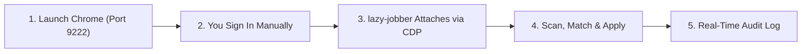

# 🤖 lazy-jobber

> **Automated Job Hunting Suite with Chrome Remote Debugging (CDP) & Smart Match Scoring.**

**lazy-jobber** automates finding, scoring, and applying for relevant jobs on major job platforms (starting with **Naukri**) using your actual, authentic browser session.

---

## 💡 How It Works (The CDP Architecture)

Most automated job bots fail because login pages, Cloudflare, CAPTCHA puzzles, and OTP verification block programmatic logins or result in account bans. 

**lazy-jobber** solves this elegantly through a 4-step hybrid workflow:



1. **Launch Browser with Debugging**: Chrome is started with `--remote-debugging-port=9222`.
2. **Log In Yourself**: You log in to Naukri / LinkedIn in this Chrome window, solving any OTP or CAPTCHA organically. No passwords or tokens are stored in the repo!
3. **Connect & Automate**: Lazy-Jobber attaches to your active Chrome instance via the Chrome DevTools Protocol (Playwright CDP).
4. **Intelligent Match Scoring**: Job descriptions are analyzed against your profile ([`profile.json`](file:///c:/Users/balag/Desktop/Coding/lazy-jobber/profile.json)) skills (e.g. Java, Spring Boot, Microservices, Kafka, AWS). Only jobs meeting your match threshold (e.g. $\ge$ 65%) are targeted.
5. **Apply & Record**: The bot triggers 1-click applications, rate-limits submissions, and updates [`applied_jobs.csv`](file:///c:/Users/balag/Desktop/Coding/lazy-jobber/applied_jobs.csv) and [`applied_jobs.json`](file:///c:/Users/balag/Desktop/Coding/lazy-jobber/applied_jobs.json).

---

## 🖥️ Modern Web UI & Dashboard

Lazy-Jobber comes with a minimalist, modern dark-mode dashboard to control and monitor applications in real-time.

```
                  ┌───────────────────────────────┐
                  │      LAZY-JOBBER DASHBOARD    │
                  ├───────────────────────────────┤
                  │  Chrome CDP: [CONNECTED :9222]│
                  │  Target Board: [ Naukri  ▼ ]  │
                  │  Target Limit: [ 40 ]         │
                  │  [ ▶ Start Jobber ] [ ⏹ Stop ]│
                  ├───────────────────────────────┤
                  │  Live Matched Postings Feed   │
                  │  Audit Summary & Statistics   │
                  └───────────────────────────────┘
```

---

## 🤖 Naukri Chatbot Questionnaire Handling (Recruiter Prompts)

When submitting applications on Naukri (individual or batch), recruiters often trigger an interactive side-drawer modal:
> *"Kindly answer all the recruiter's questions to successfully apply for the job."*

### Common Prompt Patterns & Candidate Mapping:
- **Relocation / Location**:
  - *Prompt*: *"Are you currently living in or ready to relocate to Bengaluru?"*
  - *Answer*: `Yes` (Mapped from `profile.json -> personal_info.relocation = true`).
- **Notice Period**:
  - *Prompt*: *"What is your notice period?"*
  - *Answer*: `Immediate / 15-30 Days`.
- **Experience**:
  - *Prompt*: *"Total years of experience in Java / Spring Boot?"*
  - *Answer*: `4.5` (Mapped from `profile.json -> experience_years`).
- **Confirmation Action**:
  - Auto-selects the radio button matching candidate profile and clicks the blue **Save** button.

---

## ⚡ Process Management & Clean State

To ensure zero port conflicts or lingering headless processes:
- **In-App**: Click the `⚡ Restart Server` button in the top-right navbar.
- **CLI/Batch**: Run [`restart_server.bat`](file:///c:/Users/balag/Desktop/Coding/lazy-jobber/restart_server.bat) to terminate any hanging Python instances on port 5000 and restart cleanly.

---

## 🚀 Quick Start

### 1. Set Up Environment & Install Dependencies
Activate your virtual environment and install the required packages:
```powershell
.\venv\Scripts\Activate.ps1
pip install -r requirements.txt
```

### 2. Launch Chrome with Debugging
Double-click [`launch_chrome.bat`](file:///c:/Users/balag/Desktop/Coding/lazy-jobber/launch_chrome.bat) or run:
```powershell
.\launch_chrome.bat
```
*(Sign into your Naukri account in the Chrome window that opens, and navigate to the search or home page).*

### 3. Start the Web Dashboard
```powershell
python server.py
```
Open [http://localhost:5000](http://localhost:5000) in your browser. From here, you can test your CDP connection, tune keywords, set application limits, and start the auto-apply engine with a click!

*(Alternatively, run via CLI with `python main.py`)*

---

## 🛠️ Project Structure

```
lazy-jobber/
├── launch_chrome.bat       # Helper script to launch Chrome with CDP port 9222
├── server.py               # Lightweight local backend & UI server
├── main.py                 # CLI entry point
├── config.json             # Search criteria, limits, thresholds
├── profile.json            # Parsed user skills & target titles
├── Resume (4).pdf          # Source resume
├── applied_jobs.json       # Live audit record (JSON)
├── applied_jobs.csv        # Live audit record (CSV)
├── ui/                     # Minimalist modern web UI
│   ├── index.html          # Clean single-page dashboard
│   ├── app.css             # Sleek dark-mode aesthetic styling
│   └── app.js              # Real-time state & execution client
└── src/
    ├── platforms/
    │   └── naukri_cdp.py   # Real Chrome DevTools automation for Naukri
    ├── parser.py           # Candidate profile & resume parser
    ├── matcher.py          # Skill scoring and relevance calculator
    ├── tracker.py          # Application history & deduplicator
    └── applier.py          # Application batch controller
```

---

## 🔒 Privacy & Security

- **Zero Credential Storage**: You never give this program your passwords or session tokens.
- **Local Only**: All matching, scoring, and logs are saved exclusively on your local machine.
- **Safe Limits**: Configurable application limits prevent spamming or hitting rate boundaries.
